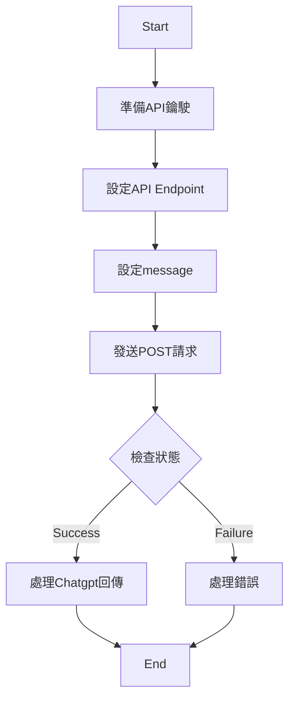

```mermaid
graph TD; 
    A[Start] --> B[準備API鑰駛];
    B --> C[設定API Endpoint];
    C --> D[設定message];
    D --> E[發送POST請求];
    E --> F{檢查狀態};
    F -->|Success| G[處理Chatgpt回傳];
    F -->|Failure| H[處理錯誤];
    G --> I[End];
    H --> I[End];
```
